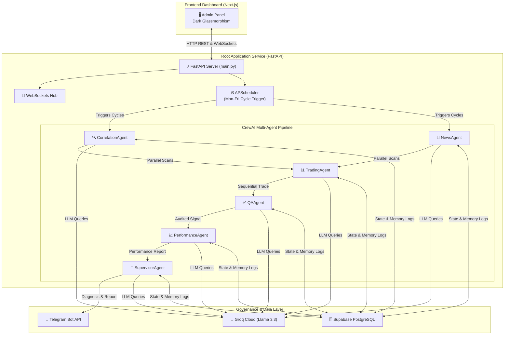

# 🚀 XAUUSD Agentic AI Company — Enterprise Platform

An enterprise-grade, multi-agent AI system designed to perform real-time gold market correlation research, news sentiment mining, paper trading execution, quality assurance audits, and supervisor-level self-healing operations.

---

## 🏗️ System Architecture



---

## 🤖 AI Agentic Roles & Communications

The platform orchestrates six specialized AI agents working together inside isolated, sequential, and parallel task execution pipelines:

| Agent Name | Enterprise Role | Core Operational Goal | Primary Tools Used |
|---|---|---|---|
| **CorrelationAgent** | Correlated Pairs Analyst | Evaluates how DXY, EURUSD, US10Y yields, cryptos, and commodities affect XAUUSD. | `ForexPriceTool`, `CommodityPriceTool`, `CryptoPriceTool`, `TreasuryYieldTool`, `NewsSearchTool` |
| **NewsAgent** | Sentiment Analyst | Mines gold news sentiment, FOMC calendar releases, and flags high-impact event warnings. | `GoldPriceTool`, `NewsSearchTool`, `NewsSentimentTool`, `EconomicCalendarTool` |
| **TradingAgent** | Portfolio Trader | Formulates entry, stop loss, and take profit levels based on correlation metrics and live spot quotes. | `GoldPriceTool`, `PaperTradeTool` |
| **QAAgent** | Risk Manager | Audits trade directions, mathematical consistency of SL/TP triggers, and logical sentiment alignment. | `GoldPriceTool` |
| **PerformanceAgent** | Desk Controller | Observes paper account transactions, computes win rate, profit factor, drawdown, and Sharpe ratio. | `TradeHistoryTool` |
| **SupervisorAgent** | Chief AI Officer | Evaluates agent heartbeats, restarts crashed worker nodes, publishes Telegram metrics, and logs lessons learned. | `AgentHealthTool`, `TelegramNotifierTool`, `AgentRestartTool`, `TeacherFeedbackTool` |

### 🔄 Dynamic Learning & Feedback Loop

To enforce continuous learning:
1. When a trade signal is completed, the **QAAgent** audits the logic. If it flags errors or if a closed trade hits Stop Loss, the **SupervisorAgent** invokes `record_teacher_feedback`.
2. This creates an entry in the database `agent_registry` under `lessons_learned` listing the mistake, correction, and teaching lesson.
3. On the next cycle execution, the system queries the registry and appends all lessons learned to the corresponding agent's backstory configuration, forcing the model to adjust its choices dynamically.

---

## 🔌 Model Context Protocol (MCP) Integrations

The platform exposes all of its tools (market data, news sentiment, trading execution, and system administration) using the **Model Context Protocol (MCP)** via two main communication channels:

### Method A: Local Subprocess Standard I/O (IDE Integration)
You can connect this toolset directly to **Claude Desktop** or **Cursor** so the AI can use them:

Add the following to your IDE configuration file:
- **Claude Desktop Configuration** (typically located at `%APPDATA%\Claude\claude_desktop_config.json`):
```json
{
  "mcpServers": {
    "xauusd-company-tools": {
      "command": "python",
      "args": ["d:/XAUUSD Agentic Company/main.py", "--mcp"],
      "env": {
        "GROQ_API_KEY": "your_groq_key_here",
        "ALPHA_VANTAGE_API_KEY": "your_alpha_vantage_key_here",
        "FRED_API_KEY": "your_fred_key_here",
        "COINGECKO_API_KEY": "your_coingecko_key_here",
        "FMP_API_KEY": "your_fmp_key_here",
        "FINNHUB_API_KEY": "your_finnhub_key_here",
        "TELEGRAM_BOT_TOKEN": "your_bot_token_here",
        "TELEGRAM_CHAT_ID": "your_chat_id_here",
        "SUPABASE_URL": "your_supabase_url",
        "SUPABASE_KEY": "your_supabase_key"
      }
    }
  }
}
```

### Method B: Remote HTTP Server-Sent Events (SSE)
FastAPI exposes endpoint hooks at `/mcp/sse` and `/mcp/messages` protected by **Supabase JWT verification**.
To connect:
1. Connect via HTTP GET to `http://localhost:8000/mcp/sse?token=YOUR_SUPABASE_JWT`.
2. Post message frames to `http://localhost:8000/mcp/messages?token=YOUR_SUPABASE_JWT`.

---

## ⚡ Technical Stack

- **Framework**: CrewAI v1.14.x (Agent Orchestration & Flow Graphs)
- **Backend Service**: FastAPI, WebSockets (Real-time live console feeds), APScheduler (Weekday CRON triggers)
- **MCP Server**: FastMCP Python SDK (SSE Transport + Stdin/Stdout execution modes)
- **LLM Brain**: Groq Cloud (Llama 3.3 70B & Llama 3.1 8B)
- **Database Layer**: Supabase (PostgreSQL tables & pgvector compatibility)
- **Frontend Client**: Next.js App Router, Tailwind CSS v4, Lucide-React Icons (Premium dark glassmorphism layout)
- **API Fallbacks**: Keyless configurations supported via `yfinance`, Frankfurter API, and Google News RSS parsers if Twelve Data/FRED keys are absent.

---

## 📂 Project Directory Structure

```
D:\XAUUSD Agentic Company\
├── README.md                           # Technical overview, workflows, & communications
├── CLAUDE.md                           # AI assistant guidelines
├── requirements.txt                    # Python dependencies
├── .env.example                         # Private environment template
├── .env                                 # Local keys configuration (git-ignored)
│
├── 📁 agents/
│   └── 📁 orchestrator/
│       └── 📄 agent.py                  # Agent configurations & task definitions
│
├── 📁 tools/
│   └── 📁 definitions/
│     ├── 📄 market_data.py            # API price scrapers & fallback utilities
│     ├── 📄 news_calendar.py          # Google News RSS parsers & macro economic calendars
│     ├── 📄 trading_performance.py    # Paper trade executions & risk calculators
│     └── 📄 system.py                 # Telemetry health checkers & Telegram transmitters
│   └── 📄 registry.py                   # FastMCP tools registrations
│
├── 📁 orchestration/
│   └── 📄 graph.py                      # FlowManager cycle routing & positions check
│
├── 📁 api/
│   └── 📁 schemas/
│       └── 📄 models.py                 # Pydantic schemas for structured outputs
│
├── 📁 governance/
│   └── 📁 audit/
│       └── 📄 supabase_client.py        # Supabase PostgreSQL connections & logs registry
│
├── 📁 supabase/
│   └── 📄 schema.sql                    # Supabase database initialization queries
│
├── 📄 main.py                           # Server runner (REST API + WebSockets)
├── 📄 setup_database.py                 # Supabase postgres DB seeder
├── 📄 get_telegram_chat_id.py           # Helper tool to link Telegram chat ID
│
└── 📁 frontend/                         # Next.js UI Dashboard
```

---

## ⚙️ How to Run the Platform

### 1. Database Setup
Ensure you seed the Supabase database before running the servers:
```bash
# Execute at root directory
python setup_database.py
```

### 2. Configure Credentials
Add your credentials inside the local `.env` file (copied from `.env.example`).

### 3. Launch Backend
Run the FastAPI application from the root folder:
```bash
# Install dependencies
pip install -r requirements.txt

# Run server
python main.py
```
*The service starts at `http://localhost:8000`. WebSocket logs will broadcast live cycles.*

### 4. Launch Frontend
Run the Next.js development server from the frontend folder:
```bash
cd frontend
npm install
npm run dev
```
*The dashboard will load at `http://localhost:3000` with dark glassmorphic styling, live price ticks, confluence meters, and logs.*

---

## 📝 Maintenance & Updates Rule
> [!IMPORTANT]
> **Maintain Documentation Integrity**: Whenever any modifications are made to the codebase (such as adding new agents, modifying task schemas, or adding new external API tools), this `README.md` file **must** be updated synchronously to reflect the modified features, workflow details, or architectural changes.
